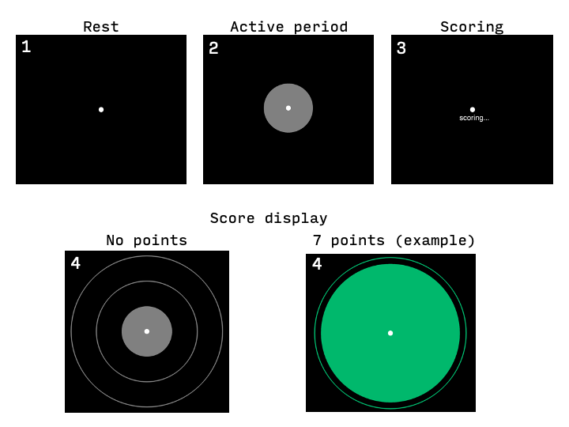

# Overview
This is an example of how rt-cloud could be used to conduct a neurofeedback experiment using an induction-based delayed feedback schema. In these types of experiments, the participant sees a induction disk (circle), and they are told to use any mental strategy to increase the size of the circle. After a period of time, they are provided with feedback in the form of the circle changing size/color, which may be paired with additional "points" or monetary reward. 

This example experiment is designed to deliver connectivity based neurofeedback, and is loosely based on [Taylor et al., 2022. *Scientific Reports*](https://www.nature.com/articles/s41598-022-05860-1), but the specific implementation is based on in-progress work at the Computational Memory Lab at Princeton.

The goal of this project is to strengthen memory control in individuals, by using neurofeedback to strengthen prefrontal inhibitory control over the hippocampus (HC). Baseline connectivity is assess during an initial think/no-think task. During the induction neurofeedback, a gPPI model is used to estimate the connectivity between the dlPFC and HC. Presented feedback is determined using the mean no-think baseline score, +/- 1 standard deviation.

On each neurofeedback session, participants first complete a T1 structural scan, followed by a short (20s) functional run. This short functional run is used to create a functional reference volume for brain masking, as well as registering masks and motion correcting the real-time scans. Participants next complete a resting state scan, during which the `initialize.py` script is run through the *session* tab on the rt-cloud web interface. This script creates the functional reference volume, and registers the standard space dlPFC and HC masks to subject space, and creates timing files for the induction experiment.

Next, participants complete 3 neurofeedback runs. Each run begins with 60s of rest to allow the real-time processing to initialize. Functional pre-processing includes motion correction, spatial smoothing (fwhm = 5mm), brain masking, high-pass filtering, and then the gPPI connectivity is assessed during each induction trial. Participants receive a total of 18 induction trials during each run and there are 6 runs, split across 2 days

Example visual feedback schema:
 

# How to run this demo:
## Prerequisites
- rt-cloud, either through docker or locally installed
- rtcloud-projects repository cloned
- PsychoPy (if you want to see the feedback in action)

## Docker
A "full" deployment of rt-cloud has three components: one to send dicoms on to the project server, the project server host, and the analysis listener that connects to the display. This is often the case if you are using a cloud computing resource to host the project server. However, it could be the case that a sufficiently powerful computer is availble locally that also has access to dicoms in real-time, as is the case here. Thus, we only need two instances, one to host the project server and another for the analysis listener.

### Project Server
Change the path below to wherever you have your rtcloud-projects folder, this is just an example.
```
projects_path="/Users/me/Documents/rtcloud-projects"
```

```
docker run --name projectServer --publish 8888:8888 \
           -it --rm --volume $projects_path:/rt-cloud/projects \
           brainiak/rtcloud:latest scripts/data_analyser.sh \
           --projectName induction --subjectRemote --test
```

Either click this link in terminal, or open a browser and navigate to **http://localhost:8888**
We are NOT using a secure connection for this demo, so login with username/password test/test. This is OK as we are not sending any data away from our computer (i.e., to a cloud resource)

### Analysis Listener
Open a new terminal instance. we first need to define our projects_path variable again, this is the same as above:
```
projects_path="/Users/me/Documents/rtcloud-projects"
```

Start the analysis listener. Note: the server address 172.17.0.1 is specific to docker.
```
docker run --name analysisListener -it --rm \
           --volume $projects_path/functionalConnectivity/outDir:/rt-cloud/outDir \
           brainiak/rtcloud:latest scripts/analysis_listener.sh \
           --server 172.17.0.1:8888 --username test --password test --test
```
If successful, you should notice that in the browser window the status for *browser*, *dataConn*, and *subjConn* should all be "connected".

### Initialize Session
We will pretend that we are running a real participant who has just completed their short functional run, which was used to create the reference volume and register masks. We will jump right into the neurofeedback.

### PsychoPy (optional)
If you wish to run the display script, open up the PsychoPy experiment file included in the induction project folder: `induction-experiment/induction.psyexp`. If you want to do this its best to have 2 monitors so that you can see both the project server and the experiment.

Start the experiment. When the dialog comes up, enter `922` as the subject number, you do not need to change anything else. If the outDirRoot field is left blank the default is to look in the outDir folder in the induction directory, but this can be changed if you want.

### Start neurofeedback
To start the experiment, navigate to the *Run* tab, and then click *Run*. If you are using PsychoPy, you will need to return to the PsychoPy window and hit "space" or "=" to mimic the first scanner trigger pulse after you start the real-time stream.

Regardless of if you are using the PsychoPy experiment, you can watch the progress of the feedback on the *Data Plots* tab. This will show a simple readout of the calculated score on each trial.

The actual speed of the real-time processing will vary greatly depending on your computer. For instance, my M1 macbook takes around 6s to process each TR, which is obviously too slow for real world use. The actual computer used for the project server should be able to handle this processing in less time than 1 TR (<2s).

## Miscellaneous notes:
- Subject designation is in bids format with project abbreviation sup-RP000
- Dicom folder is based on datestring, which is how it comes off of the scanner in our facility. To keep this as close to a real-world example as possible this format is kept, and the default datestring is changed in the `.toml` file. If the default value is changed back to None, then the actual date is used by the code.
- outRoot in config can be changed to specify a different directory, but if the value is None, then the default is to use the project directory, where the `.py` files for the project are.